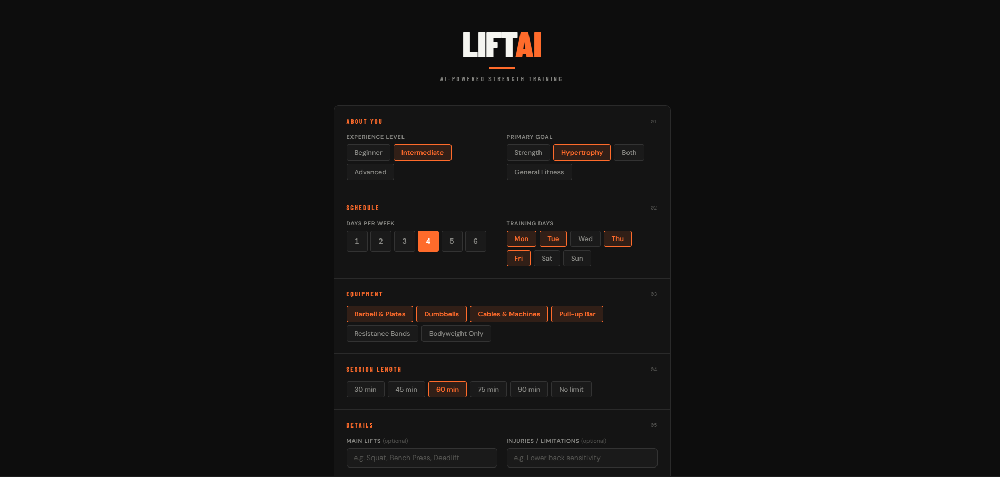
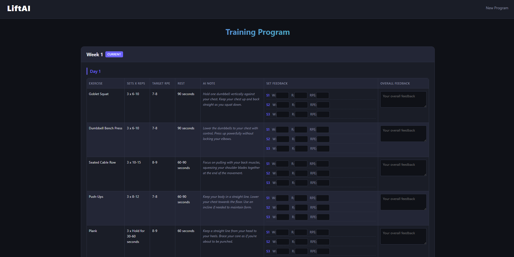

# LiftAI: Agent-Based Strength Training Program Generator

## Overview
LiftAI is an agent-based AI system that uses Retrieval-Augmented Generation (RAG) to produce personalized strength training programs. Built on a LangGraph framework, it employs a multi-agent architecture backed by a domain-specific vector database of training literature. The system dynamically adjusts training variables — training split, set volume, intensity, exercise selection, and progression — based on user input and performance data, aiming to provide accessible, individualized strength training guidance at high quality to a fraction of the price.

## Screenshots

### Program Generation

### Program View

## System Configuration

### 1. API Credentials
To enable the generative capabilities of the system, a Google Gemini API key is required.
*   Create a file named `cre.env` in the root directory.
*   Insert your API key into this file.
*   The `agent_system/setup_api.py` module will automatically load this key to authenticate AI model requests.

### 2. Knowledge Base Initialization (RAG)
The system utilizes a local FAISS vector database to retrieve context-aware information from strength training literature.

*   **Data Ingestion:** Deposit relevant PDF documents into the `Data/books/` directory.
*   **Database Construction:** Execute the `build_db.py` script. This process parses the PDF content and generates embeddings within `Data/faiss_db/`, enabling the AI to reference authoritative sources.

## Architectural Components

The system operates through a Flask-based web interface and a coordinated team of AI agents.

### Core Application
*   **`app.py` (Web Interface):** This module serves as the user entry point, handling input parameters and rendering the generated programs. It supports testing via predefined personas located in `Data/personas/personas_vers2.json`.

### AI Agent Workflow
The generation process is managed by `agent_system/generator.py`, which orchestrates a LangGraph workflow involving the following specialized agents:

*   **Writer Agent (`agent_system/agents/writer.py`):** Responsible for drafting the initial training program and implementing revisions. It queries the RAG system to ensure scientific accuracy.
*   **Critic Agent (`agent_system/agents/critic.py`):** Rigorously evaluates the draft against key metrics such as volume, frequency, and RPE (Rate of Perceived Exertion). It provides constructive feedback to the Writer.
*   **Editor Agent (`agent_system/agents/editor.py`):** Ensures the final output adheres to a strict JSON schema for seamless integration with the web frontend.

### Supporting Infrastructure
*   **`agent_system/setup_api.py`:** Manages the connection to the Google Gemini API.
*   **`rag_retrieval.py`:** The retrieval engine that allows agents to query the FAISS vector store for specific training principles.
*   **`prompts/`:** A collection of system instructions defining the operational parameters and personas for each AI agent.

